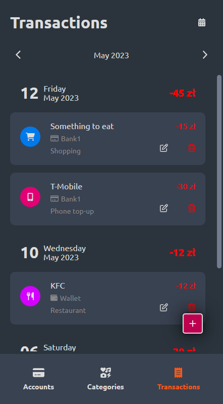

# Money Manager

## Table of contents
* [General info](#general-info)
* [Technologies](#technologies)
* [Getting Started](#getting-started)

## General info
The purpose of the project was to create an application for basic financial management and consolidate knowledge about React, Typescript and check how Firebase works.
This project is created with React.js and bootstrapped with [Create React App](https://github.com/facebook/create-react-app).
Money Manager includes features such as:
* balance control on individual accounts
* adding, modifying and deleting accounts
* adding, modifying and deleting categories
* adding, modifying and deleting transactions

To Do:
* register and login functionality
* Google and Github authentication
* change modal style
* statistics page with charts

You can see the project [here](https://moneymanager-mw.web.app/).




## Technologies
* React v18.2
* TypeScript
* Firebase
* react-modal
* styled-components
* FontAwesome
* downshift
* framer-motion
* ESLint
* Prettier

## Getting Started

First you should clone this repository on your computer:

```bash
git clone https://github.com/mwojcik7/messenger-clone.git
```

Next you need install packages:

```bash
npm install
#or
yarn install
```

Finally run the development server:

```bash
npm start
# or
yarn start
```

Open [http://localhost:3000](http://localhost:3000) with your browser to see the result.